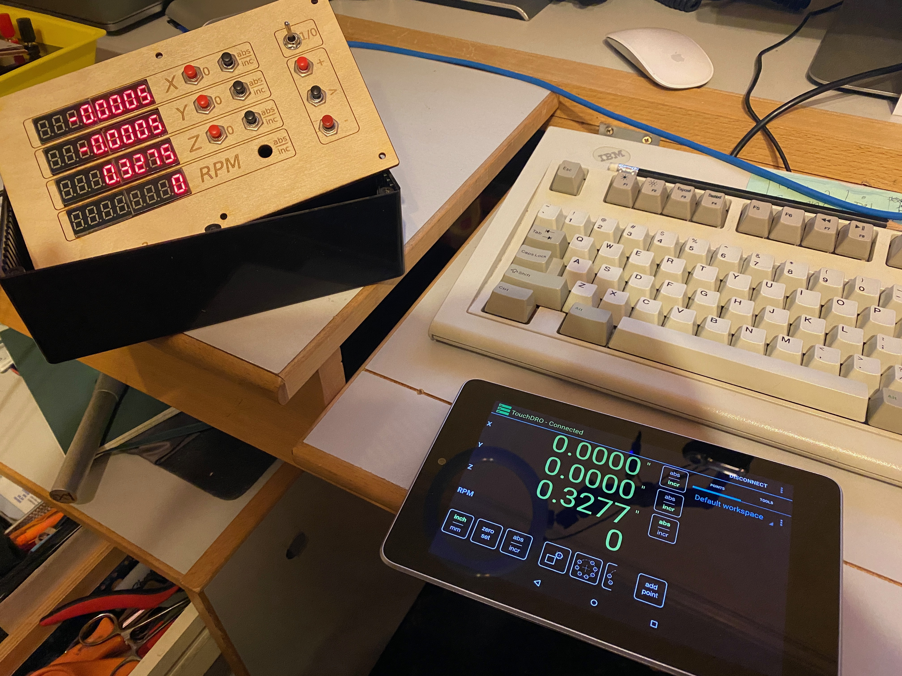

# Arduino_DRO

Firmware for Arduino DRO with up to 4 Axis display, Tachometer, Touch Probe, and Bluetooth output suitable for [Touch DRO](https://www.yuriystoys.com).

This repository is heavily based on the v6.0 code from [Rysiu M](http://rysium.com/projects/197-arduino-dro-q) for connecting cheap digital scales (typically found on machine tools) to an Arduino and sending those data via Bluetooth or serial to a display like [TouchDRO](http://www.yuriystoys.com/p/android-dro.html). The display and interaction portions are influenced by the [People's DRO](https://www.chipmaker.ru/topic/143676) on [chipmaker.ru](https://www.chipmaker.ru) (or at least that's what Google Translate told me the name was).

## Why Another Android DRO Project

I just couldn't find the one I was looking for. RysiuM's is great for working with Touch DRO, but does not have a local non-connected to an Android tablet display option. Oleg A.'s People's DRO has local display, but no ability to connect to Touch DRO. I wanted both. 

## User Guide

**NOTE**: This part is not working yet, it's a design specification.

Display

| A/I | x | x | x | x | x | x | x |
| A/I | x | x | x | x | x | x | x | 
| A/I | x | x | x | x | x | x | x | 
| x   | x | x | x | x | x | x | x |

## Operating / DRO Mode

| Button    | Function                          | Notes |
| ---       | ---                               | ---   |
| X0        | Zero the X axis                   | display changes to "I" and sets zero point |
| Y0        | Zero the Y axis                   | display changes to "I" and sets zero point |
| Z0        | Zero the Z axis                   | display changes to "I" and sets zero point |
| X (a/i)   | Change abs/inc mode for X axis    | mode changes between "A" / " "            |
| Y (a/i)   | Change abs/inc mode for Y axis    | mode changes between "A" / " "            |
| Z (a/i)   | Change abs/inc mode for Z axis    | mode changes between "A" / " "            |
| ---       | ---                               | ---                       |
| + (up)    | 1/2 value mode                    |
| > (select)| Enter menu                        |
| - (down)  | Enter inc mode and zero all axes  |
| ---       | ---                               |

## Menu

The following buttons to navigate the menu are active when the menu is activated.
If no button is pressed for 15 seconds the menu will be dismissed and
the Operating / DRO mode will resume.

| Button    | Function                          | Notes |
| ---       | ---                               | ---   |
| + (up)    | Move to next menu item / setting  |       |
| > (select)| Select displayed menu item        |       |
| - (down)  | Move to previous menu item / setting |    |
| ---       | ---                               | ---   |

The remaining buttons depend on current menu selection and operate as if you had
selected that menu item, e.g. the buttons "fall through" to the displayed menu 
selection.

The menu items are.

| Display   | Action | Notes |
| ---       | --- | --- |
| Reverse   | Invert axis value | Select axis and it's value is negated |
| Units     | Change display units | Toggle between mnches and mm |
| Bright    | Change display intensity | |
| CPI       | Change "counts per inch" for axis | Select axis and change value |
| 1/2 axis  | Divide axis value by 1/2 | Select axis and it's value is halved |
| Set Value | Set the value of an axis | Select axis and change value |
| Zero All  | Change all axes to incremental and set their zero | erases previous zero values |

Some menu items, like "zero all" take effect immediately, while others invoke a 
sub-mode where further interaction is required. These sub-modes and the relevant button
interactions are detailed below. These are also the "fall through" buttons
as described above.

## 1/2 Axis

| Button    | Function                          | Notes |
| ---       | ---                               | ---   |
| X0        | Divide current X value by 2       | returns to operating/DRO mode |
| Y0        | Divide current X value by 2       | returns to operating/DRO mode |
| Z0        | Divide current X value by 2       | returns to operating/DRO mode |
| ---       | ---                               | ---   |

## Reverse Axis

| Button    | Function                      | Notes |
| ---       | ---                           | ---   |
| X0        | Invert the X axis value       | returns to operating/DRO mode |
| Y0        | Invert the X axis value       | returns to operating/DRO mode |
| Z0        | Invert the X axis value       | returns to operating/DRO mode |
| ---       | ---                           | ---   |

## Brightness

| Button    | Function                      | Notes |
| ---       | ---                           | ---   |
| up        | Increase display intensity    |  |
| select    | Save the current intensity    | returns to operating/DRO mode |
| down      | Decrease display intensity    | |
| ---       | ---                           | ---   |

## Notes

- inch mode displays 4 digit precision, mm mode 3 digits. the last digit is rounded to 0 or 5, similar to the display that comes with the iGaging scales.

## Ideas

- use 'long-press' in some way to get more 'buttons'
- axis should blink when setting values / changing numbers

- use rotary encoder to change numbers
- Use last decimal point to show 'mm' no decimal point means inches
- auto-adapt to significant digits? -- auto adapt to larger numbers change .
- iGaging scales are only accurate to 0.001" and 0.01mm
- `_-99.9999"` and `_-999.999mm` is overkill by 1

- Notes from https://www.chipmaker.ru/topic/143676/?page=31 and https://www.chipmaker.ru/topic/143676/?page=13

    - left button jumps by digits,
    - up / down buttons respectively increases / decreases the modulus of the number (active sign), from 0 to 9

    - on a sign discharge:

        - up button - makes the number positive and automatically exits the correction mode, if it was positive the sign of the number does not change ,

        - down button - accordingly makes the number negative and exit the correction mode, if it was negative the sign of the number does not change ,

    - At any time, you can exit the correction mode by pressing the first button of the axis to be corrected.

    - Button "X1", "Y1":
        first press - activate the axis setting (axis blinks)
        repeated pressing (within 15 seconds) reset the axis to 0 and exit to operating mode,
        inactivity 15 sec. - exit to operating mode 

    - Button "<" - each press during active axis setting - transition by digits (active digit blinks)
        inactivity 15 sec. - exit to operating mode

    - Button "+", "-" - increases / decreases the value of the active digit
        after passing all the digits (the dot and the “-” sign flash if the number is negative) - use the “+” , “-” buttons to set the positive / negative sign of the dialed / corrected value, and automatically exit to working mode.

        In the operating mode, you can also exit at any level - by pressing 1 button of the active axis.

    - Button "Z2" :
        - switches the display of readings revolutions / cutting speed, "A" - revolutions / minute, "b" - meters / minute
        - cutting speed is always tied to the readings of the "Y" axis .

* The modes "Radius", "Diameter" are displayed by the symbols "r", "d".

* The modes "Tachometer", "Cutting speed" are displayed by the symbols "t", "S".

## Wiring

I don't have a schematic as I just hand-wired things. For those looking for the connections. I'm including a few photos to help. If I get time, I'll draw up the schematic but no promises.

* [Microcontroller and Scales](images/wiring-micro.jpg)
* [Display and Buttons](images/wiring-panel.jpg)